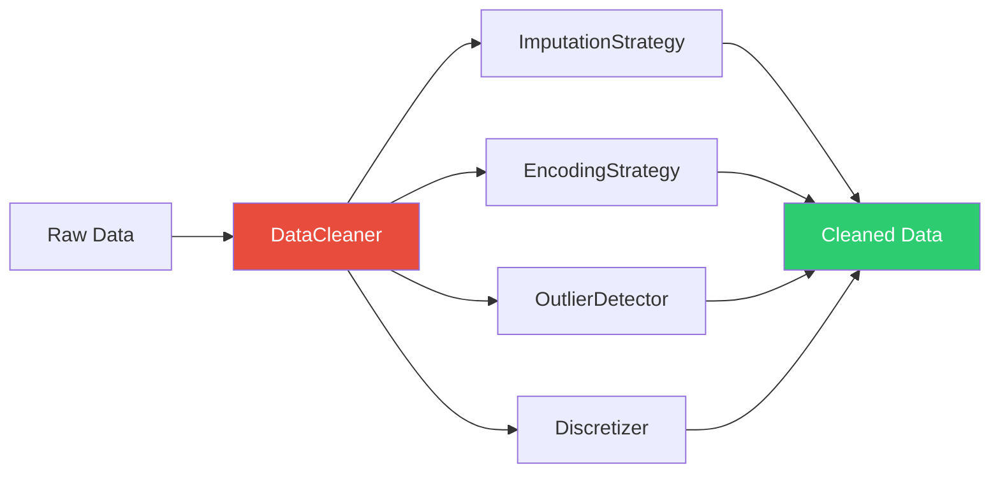

# Data Cleaning Module

The cleaning module provides comprehensive data cleaning, imputation, encoding, and outlier detection capabilities.

## Overview

The cleaning module handles all aspects of data quality and transformation:

- **Missing value imputation** with multiple strategies
- **Categorical encoding** (one-hot, label, target encoding)
- **Outlier detection and handling** (IQR, Z-score, Isolation Forest)
- **Feature discretization** for continuous variables
- **Metadata management** for variable types and characteristics

## Submodules

- [`cleaner`](cleaner.md) - Main cleaning orchestration
- [`imputation`](imputation.md) - Missing value strategies
- [`encoding`](encoding.md) - Categorical variable encoding
- [`discretization`](discretization.md) - Continuous variable binning
- [`outliers`](outliers.md) - Outlier detection and treatment
- [`metadata`](metadata.md) - Variable metadata handling

## Quick Example

```python
from src.cleaning.cleaner import DataCleaner
import pandas as pd

# Load data
df = pd.read_csv("raw_data.csv")

# Initialize cleaner
cleaner = DataCleaner(
    target_column="mortality_inhospital",
    metadata_path="variable_metadata.json"
)

# Clean data
cleaned_df = cleaner.clean(df)

# Access cleaning report
print(cleaner.get_report())
```

## Module Architecture



## Common Workflows

### Basic Cleaning Pipeline

```python
from src.cleaning.cleaner import DataCleaner

cleaner = DataCleaner(
    target_column="mortality_inhospital",
    missing_threshold=0.5,  # Drop columns with >50% missing
    outlier_method="iqr"    # Use IQR for outlier detection
)

cleaned_df = cleaner.clean(raw_df)
```

### Custom Imputation

```python
from src.cleaning.imputation import (
    SimpleImputationStrategy,
    KNNImputationStrategy,
    IterativeImputationStrategy
)

# Median imputation for numeric features
median_imputer = SimpleImputationStrategy(strategy="median")

# KNN imputation
knn_imputer = KNNImputationStrategy(n_neighbors=5)

# MICE imputation
mice_imputer = IterativeImputationStrategy(max_iter=10)
```

### Categorical Encoding

```python
from src.cleaning.encoding import (
    OneHotEncodingStrategy,
    LabelEncodingStrategy,
    TargetEncodingStrategy
)

# One-hot encoding for nominal variables
onehot = OneHotEncodingStrategy()
encoded_df = onehot.encode(df, columns=["sex", "admission_type"])

# Target encoding for high-cardinality features
target_enc = TargetEncodingStrategy(target_column="mortality_inhospital")
encoded_df = target_enc.encode(df, columns=["diagnosis_code"])
```

### Outlier Detection

```python
from src.cleaning.outliers import OutlierDetector

detector = OutlierDetector(method="isolation_forest")

# Detect outliers
outlier_mask = detector.detect(df, columns=["age", "heart_rate", "bp"])

# Remove outliers
df_clean = df[~outlier_mask]

# Or cap outliers
df_capped = detector.cap_outliers(df, columns=["age", "heart_rate"])
```

## Class Reference

::: src.cleaning.cleaner.DataCleaner
    options:
      show_source: true
      heading_level: 3
      members:
        - __init__
        - clean
        - get_report
        - save_cleaned_data

## Best Practices

!!! tip "Always Use Metadata"
    Define variable types in `variable_metadata.json` for consistent cleaning:
    
    ```json
    {
      "age": {"type": "continuous", "unit": "years"},
      "sex": {"type": "categorical", "categories": ["M", "F"]},
      "mortality_inhospital": {"type": "binary", "target": true}
    }
    ```

!!! tip "Handle Missing Data Strategically"
    Choose imputation based on missingness pattern:
    
    - **MCAR** (Missing Completely at Random): Simple imputation (mean/median)
    - **MAR** (Missing at Random): KNN or MICE imputation
    - **MNAR** (Missing Not at Random): Consider creating missing indicators

!!! warning "Be Careful with Outliers"
    Don't blindly remove outliers in medical data - they may be clinically meaningful:
    
    ```python
    # Review outliers before removal
    outliers = detector.detect(df)
    print(f"Found {outliers.sum()} potential outliers")
    
    # Investigate extreme values
    df[outliers].describe()
    ```

## See Also

- [EDA Module](../eda/index.md) - Analyze data quality
- [Preprocessing Module](../preprocessing/pipelines.md) - Transform cleaned data
- [Data Cleaning Guide](../../user-guide/data-cleaning.md) - User-friendly guide

