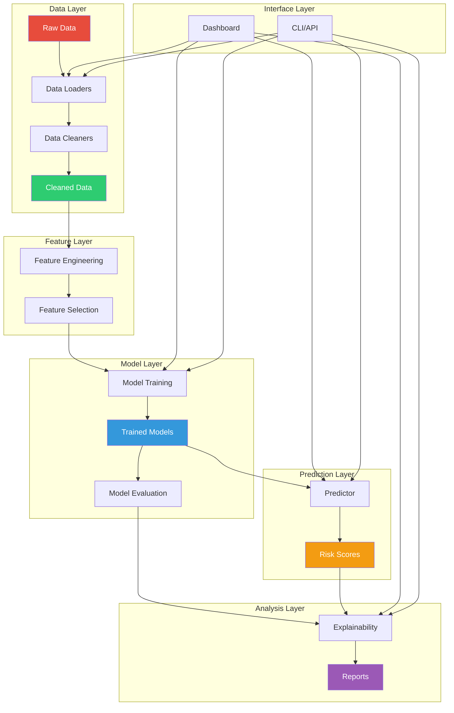
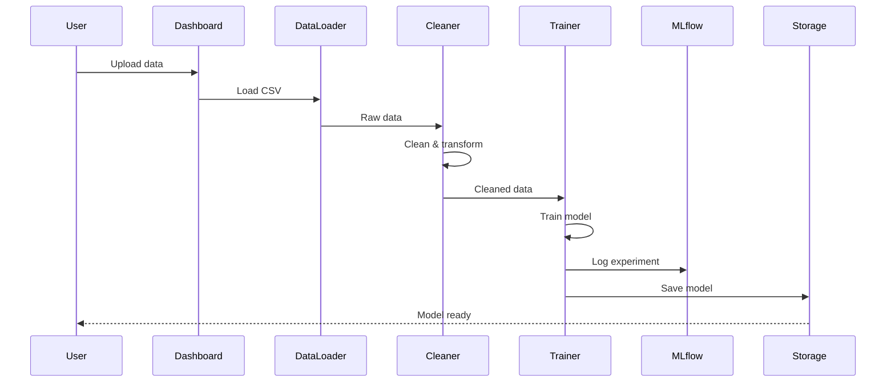
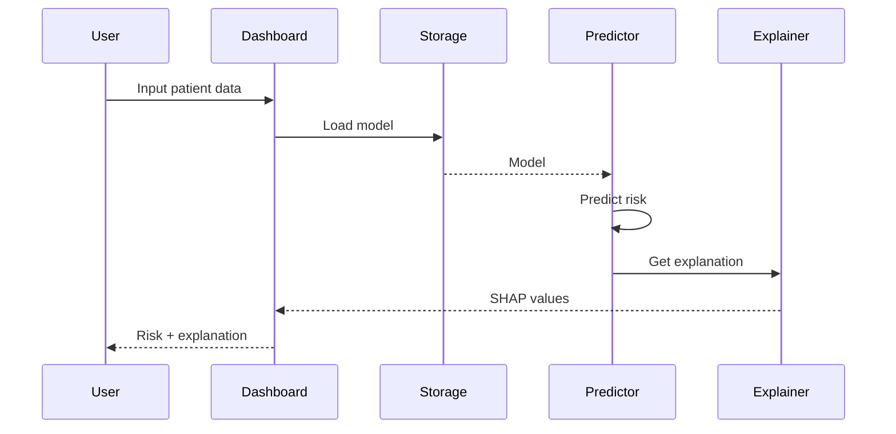
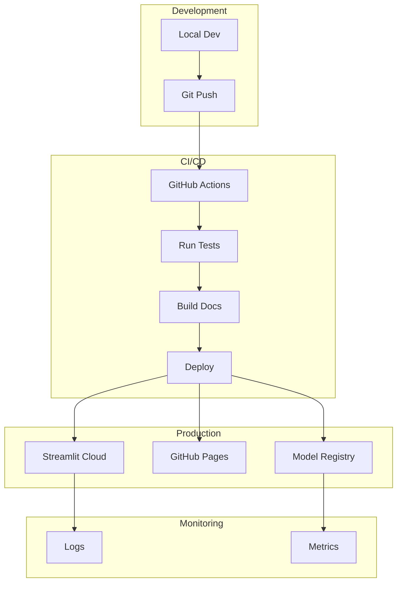

# Architecture

System architecture and design documentation for the Mortality AMI Predictor.

## Overview

The Mortality AMI Predictor follows a modular, layered architecture designed for:

- **Maintainability**: Clear separation of concerns
- **Extensibility**: Easy to add new features
- **Reproducibility**: Version control and experiment tracking
- **Deployment**: Ready for production use

## System Architecture



## Module Structure

### Core Modules

```
src/
├── config.py           # Configuration management
├── cleaning/           # Data cleaning
│   ├── cleaner.py
│   ├── imputation.py
│   ├── encoding.py
│   └── outliers.py
├── data_load/          # Data I/O
│   ├── loaders.py
│   ├── splitters.py
│   └── io_utils.py
├── eda/                # Exploratory analysis
│   ├── analyzer.py
│   ├── visualizations.py
│   └── pdf_reports.py
├── features/           # Feature engineering
│   ├── transformers.py
│   └── selectors.py
├── models/             # Model definitions
│   ├── classifiers.py
│   ├── neural_networks.py
│   ├── custom_base.py
│   └── registry.py
├── training/           # Training pipeline
│   ├── trainer.py
│   ├── cross_validation.py
│   └── hyperparameter_tuning.py
├── evaluation/         # Model evaluation
│   ├── metrics.py
│   ├── calibration.py
│   └── reporters.py
├── explainability/     # Model interpretation
│   ├── shap_analysis.py
│   ├── partial_dependence.py
│   └── permutation.py
├── prediction/         # Predictions
│   └── predictor.py
├── scoring/            # Clinical scores
│   ├── grace.py
│   └── timi.py
└── reporting/          # PDF generation
    └── pdf_generator.py
```

## Data Flow

### Training Pipeline



### Prediction Pipeline



## Design Patterns

### Factory Pattern (Model Registry)

```python
# models/registry.py
class ModelRegistry:
    _models = {}
    
    @classmethod
    def register_model(cls, name, model_class):
        cls._models[name] = model_class
    
    @classmethod
    def get_model(cls, name):
        return cls._models[name]
```

### Strategy Pattern (Imputation)

```python
# cleaning/imputation.py
class ImputationStrategy:
    def fit_transform(self, X):
        raise NotImplementedError

class SimpleImputationStrategy(ImputationStrategy):
    def fit_transform(self, X):
        # Simple imputation logic
        pass

class KNNImputationStrategy(ImputationStrategy):
    def fit_transform(self, X):
        # KNN imputation logic
        pass
```

### Builder Pattern (EDA Reports)

```python
# eda/analyzer.py
class EDAAnalyzer:
    def __init__(self, df):
        self.df = df
        self.plots = []
    
    def add_univariate_analysis(self):
        # Add univariate plots
        return self
    
    def add_bivariate_analysis(self):
        # Add bivariate plots
        return self
    
    def generate_report(self):
        # Build PDF report
        pass
```

## Configuration Management

### Hierarchical Configuration

```python
# config.py
class Config:
    """Hierarchical configuration."""
    
    # Defaults
    DATA_DIR = "DATA"
    PROCESSED_DIR = "processed"
    
    # Load from environment
    @classmethod
    def from_env(cls):
        config = cls()
        config.DATA_DIR = os.getenv("DATA_DIR", config.DATA_DIR)
        return config
    
    # Load from file
    @classmethod
    def from_yaml(cls, path):
        with open(path) as f:
            data = yaml.safe_load(f)
        config = cls()
        config.__dict__.update(data)
        return config
```

## Experiment Tracking

### MLflow Integration

```python
import mlflow

# Auto-logging
mlflow.autolog()

# Manual logging
with mlflow.start_run():
    mlflow.log_params(params)
    mlflow.log_metrics(metrics)
    mlflow.sklearn.log_model(model, "model")
```

## Deployment Architecture



## Extensibility Points

### Adding New Models

1. Create model class inheriting from `BaseEstimator`
2. Register in `models/registry.py`
3. Model automatically available in dashboard

### Adding New Cleaners

1. Create strategy inheriting from base strategy
2. Register in `cleaning/__init__.py`
3. Available in `DataCleaner`

### Adding New Metrics

1. Add function to `evaluation/metrics.py`
2. Update `calculate_all_metrics()`
3. Metric appears in reports

## Performance Considerations

### Memory Management

- Use chunking for large datasets
- Lazy loading with generators
- Clear intermediate results

### Computation Optimization

- Vectorized operations with NumPy
- Parallel processing with joblib
- GPU acceleration for neural networks

## Security

### Data Privacy

- No PHI in logs
- Secure credential management
- Encrypted model storage

### Input Validation

- Schema validation for inputs
- Range checks on clinical values
- SQL injection prevention

## Testing Strategy

```
tests/
├── test_data_cleaning.py
├── test_training.py
├── test_prediction.py
├── test_custom_models.py
└── test_integration.py
```

See [Developer Guide](../developer/) for testing details.

## See Also

- [Developer Guide](../developer/)
- [API Reference](../api/)
- [User Guide](../user-guide/)
