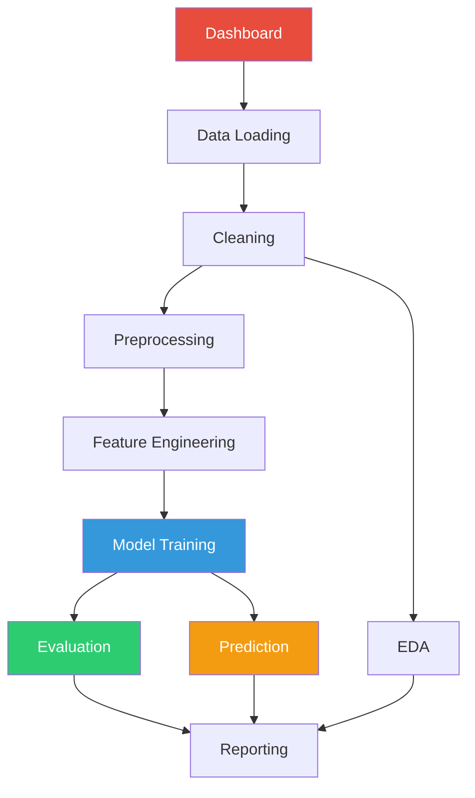

---
hide:
  - navigation
  - toc
---

# 🫀 Mortality AMI Predictor

<div align="center">
  
  
  <p><strong>End-to-end ML system for predicting in-hospital mortality and ventricular arrhythmias in AMI patients</strong></p>
  
  [](https://www.python.org/downloads/)
  [](https://opensource.org/licenses/MIT)
  [](https://mortality-ami-predictor.github.io)
</div>

---

## 🎯 Overview

The **Mortality AMI Predictor** is a comprehensive machine learning system designed to predict clinical outcomes in patients with Acute Myocardial Infarction (AMI). The system features:

- 🧹 **Automated data cleaning and preprocessing**
- 📊 **Interactive exploratory data analysis**
- 🤖 **Multiple ML model training and comparison**
- 🔮 **Real-time prediction capabilities**
- 📈 **Comprehensive model evaluation**
- 🔍 **Advanced explainability (SHAP, PDP, permutation importance)**
- 📋 **Clinical scoring systems (GRACE, TIMI, Killip)**
- 🔧 **Custom model creation and integration**
- 🌐 **Interactive Streamlit dashboard**

## ✨ Key Features

<div class="grid cards" markdown>

-   :material-broom:{ .lg .middle } __Data Cleaning__

    ---

    Automated cleaning with missing value imputation, outlier detection, and feature engineering

    [:octicons-arrow-right-24: Learn more](user-guide/data-cleaning.md)

-   :material-chart-line:{ .lg .middle } __EDA & Visualization__

    ---

    Interactive univariate, bivariate, and multivariate analysis with publication-quality plots

    [:octicons-arrow-right-24: Learn more](user-guide/eda.md)

-   :material-robot:{ .lg .middle } __Model Training__

    ---

    Support for Logistic Regression, Random Forest, XGBoost, Neural Networks, and custom models

    [:octicons-arrow-right-24: Learn more](user-guide/training.md)

-   :material-crystal-ball:{ .lg .middle } __Predictions__

    ---

    Real-time predictions with confidence intervals and risk stratification

    [:octicons-arrow-right-24: Learn more](user-guide/predictions.md)

-   :material-chart-box:{ .lg .middle } __Evaluation__

    ---

    ROC curves, calibration plots, decision curve analysis, and bootstrap validation

    [:octicons-arrow-right-24: Learn more](user-guide/evaluation.md)

-   :material-magnify:{ .lg .middle } __Explainability__

    ---

    SHAP values, partial dependence plots, and permutation importance for model interpretation

    [:octicons-arrow-right-24: Learn more](user-guide/explainability.md)

-   :material-clipboard-pulse:{ .lg .middle } __Clinical Scores__

    ---

    Calculate GRACE, TIMI, and Killip scores for clinical validation

    [:octicons-arrow-right-24: Learn more](user-guide/clinical-scores.md)

-   :material-wrench:{ .lg .middle } __Custom Models__

    ---

    Create and integrate your own scikit-learn compatible models seamlessly

    [:octicons-arrow-right-24: Learn more](user-guide/custom-models.md)

</div>

## 🚀 Quick Start

Get started with Mortality AMI Predictor in just a few steps:

```bash
# Clone the repository
git clone https://github.com/Pol4720/mortality-ami-predictor.git
cd mortality-ami-predictor/Tools

# Install dependencies
pip install -r requirements.txt

# Launch the dashboard
streamlit run dashboard/Dashboard.py
```

👉 For detailed installation instructions, see the [Installation Guide](getting-started/installation.md)

## 📚 Documentation Structure

<div class="grid" markdown>

<div markdown>

### For Users
- [**Getting Started**](getting-started/installation.md) - Installation and setup
- [**User Guide**](user-guide/dashboard.md) - Complete feature walkthrough
- [**API Reference**](api/index.md) - Detailed module documentation

</div>

<div markdown>

### For Developers
- [**Architecture**](architecture/patterns.md) - Design patterns and structure
- [**Developer Guide**](developer/contributing.md) - Contributing guidelines
- [**Testing**](developer/testing.md) - Testing strategies

</div>

</div>

## 🏗️ Architecture

The project follows a **modular, professional architecture** with clear separation of concerns:



👉 Learn more about the [Architecture](architecture/patterns.md) and [Module Structure](architecture/structure.md)

## 🎨 Technology Stack

- **Core**: Python 3.8+
- **ML Frameworks**: scikit-learn, XGBoost, TensorFlow/Keras
- **Data**: pandas, NumPy, polars
- **Visualization**: matplotlib, seaborn, plotly
- **Dashboard**: Streamlit
- **Explainability**: SHAP, PDPbox
- **Tracking**: MLflow, Weights & Biases
- **Documentation**: MkDocs Material
- **Testing**: pytest

## 📊 Example Use Cases

### 1. Train a Model

```python
from src.training.trainer import ModelTrainer
from src.data_load.loaders import load_cleaned_dataset

# Load data
X_train, X_test, y_train, y_test = load_cleaned_dataset("path/to/data.csv")

# Train model
trainer = ModelTrainer(model_type="xgboost")
model = trainer.train(X_train, y_train)

# Evaluate
from src.evaluation.metrics import calculate_all_metrics
metrics = calculate_all_metrics(model, X_test, y_test)
print(metrics)
```

### 2. Make Predictions

```python
from src.prediction.predictor import Predictor

# Load trained model and make predictions
predictor = Predictor("path/to/model.joblib")
risk_score = predictor.predict_proba(patient_data)
print(f"Mortality risk: {risk_score:.2%}")
```

### 3. Explain Predictions

```python
from src.explainability.shap_analysis import SHAPAnalyzer

# Generate SHAP explanations
analyzer = SHAPAnalyzer(model, X_train)
analyzer.plot_waterfall(patient_data, save_path="explanation.png")
```

## 🤝 Contributing

We welcome contributions! Please see our [Contributing Guide](developer/contributing.md) for details on:

- Code style and standards
- Testing requirements
- Pull request process
- Development workflow

## 📄 License

This project is licensed under the MIT License - see the [LICENSE](https://github.com/Pol4720/mortality-ami-predictor/blob/main/LICENSE) file for details.

## 🙏 Acknowledgments

This project was developed as part of a research initiative to improve clinical decision-making for AMI patients using machine learning.

---

<div align="center">
  <p><strong>Ready to get started?</strong></p>
  <p>
    <a href="getting-started/installation/">Install Now</a> •
    <a href="getting-started/quickstart/">Quick Start</a> •
    <a href="api/index/">API Reference</a> •
    <a href="https://github.com/Pol4720/mortality-ami-predictor">GitHub</a>
  </p>
</div>
