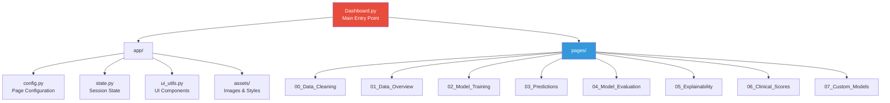
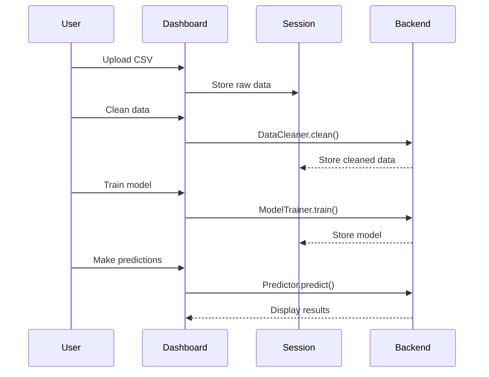

# Dashboard Overview

Complete guide to the Mortality AMI Predictor Streamlit Dashboard.

## Introduction

The Mortality AMI Predictor Dashboard is a **web-based interactive application** built with Streamlit that provides a complete workflow for AMI mortality prediction, from data cleaning to model deployment and explainability.

## Launching the Dashboard

### Method 1: Direct Launch

```bash
cd Tools/dashboard
streamlit run Dashboard.py
```

### Method 2: From Project Root

```bash
cd Tools
python -m streamlit run dashboard/Dashboard.py
```

### Method 3: Custom Port

```bash
streamlit run Dashboard.py --server.port 8501
```

The dashboard will open automatically in your browser at `http://localhost:8501`

## Dashboard Architecture



## Pages Structure

The dashboard consists of **8 pages**, each focused on a specific task:

| Page | Icon | Purpose |
|------|------|---------|
| **Dashboard** | 🏥 | Main landing page with overview |
| **Data Cleaning** | 🧹 | Clean and preprocess raw data |
| **Data Overview** | 📊 | Explore dataset statistics and distributions |
| **Model Training** | 🤖 | Train ML models with hyperparameter tuning |
| **Predictions** | 🔮 | Make predictions on new patients |
| **Model Evaluation** | 📈 | Evaluate model performance with metrics |
| **Explainability** | 🔍 | Understand model decisions with SHAP |
| **Clinical Scores** | 📋 | Calculate traditional clinical risk scores |
| **Custom Models** | 🔧 | Create and integrate custom models |

## Navigation

### Sidebar Navigation

The sidebar provides:
- **Logo**: Project branding
- **Page Selector**: Navigate between pages
- **Settings**: Configuration options
- **Session Info**: Current dataset and model status

### Page Layout

Each page follows a consistent layout:

```
┌─────────────────────────────────────────┐
│ Page Title                              │
│ Brief description                       │
├─────────────────────────────────────────┤
│ Input Section                           │
│ - File uploaders                        │
│ - Parameter controls                    │
│ - Action buttons                        │
├─────────────────────────────────────────┤
│ Results Section                         │
│ - Metrics                               │
│ - Visualizations                        │
│ - Data tables                           │
├─────────────────────────────────────────┤
│ Export Section                          │
│ - Download buttons                      │
│ - Save options                          │
└─────────────────────────────────────────┘
```

## Session State Management

The dashboard maintains state across pages using Streamlit's session state:

```python
# Key session state variables
st.session_state.data          # Current dataset
st.session_state.model         # Trained model
st.session_state.X_train       # Training features
st.session_state.y_train       # Training labels
st.session_state.X_test        # Test features
st.session_state.y_test        # Test labels
st.session_state.cleaner       # Data cleaner instance
st.session_state.predictions   # Recent predictions
```

## Data Flow



## Features

### 1. Real-time Processing

All computations happen in real-time:
- Data cleaning
- Model training
- Predictions
- Visualizations

### 2. Interactive Visualizations

Built with Plotly for interactivity:
- **Zoom**: Click and drag
- **Pan**: Hold shift + drag
- **Hover**: See detailed values
- **Download**: Camera icon to save

### 3. File Management

Upload and download:
- **CSV files**: Data input/output
- **Models**: `.joblib` format
- **Reports**: PDF reports
- **Plots**: PNG images

### 4. Caching

Streamlit's `@st.cache_data` optimizes:
- Data loading
- Model training
- Large computations

### 5. Error Handling

User-friendly error messages:
- Missing data warnings
- Invalid input alerts
- Training failures
- Prediction errors

## Customization

### Theme

Edit `.streamlit/config.toml`:

```toml
[theme]
primaryColor = "#B71C1C"
backgroundColor = "#FFFFFF"
secondaryBackgroundColor = "#F0F2F6"
textColor = "#262730"
font = "sans serif"
```

### Layout

Modify page layout in each page file:

```python
# Wide layout
st.set_page_config(layout="wide")

# Centered layout (default)
st.set_page_config(layout="centered")
```

### Sidebar

Customize sidebar in `app/config.py`:

```python
def configure_sidebar():
    st.sidebar.image("logo.png")
    st.sidebar.title("My Custom Title")
    # Add custom widgets
```

## Performance Tips

### 1. Use Caching

```python
@st.cache_data
def load_data(file_path):
    return pd.read_csv(file_path)
```

### 2. Lazy Loading

Load data only when needed:

```python
if st.button("Load Data"):
    data = load_large_dataset()
```

### 3. Progress Bars

Show progress for long operations:

```python
progress_bar = st.progress(0)
for i, item in enumerate(items):
    process(item)
    progress_bar.progress((i + 1) / len(items))
```

### 4. Batch Processing

Process large datasets in chunks:

```python
chunk_size = 1000
for chunk in pd.read_csv("data.csv", chunksize=chunk_size):
    process_chunk(chunk)
```

## Deployment

### Local Deployment

Already covered above - just run `streamlit run Dashboard.py`

### Streamlit Cloud

1. Push code to GitHub
2. Go to [share.streamlit.io](https://share.streamlit.io)
3. Connect your repo
4. Select `Dashboard.py` as entry point
5. Deploy!

### Docker

```dockerfile
FROM python:3.11-slim

WORKDIR /app
COPY Tools/ /app/
RUN pip install -r requirements.txt

EXPOSE 8501
CMD ["streamlit", "run", "dashboard/Dashboard.py"]
```

Build and run:

```bash
docker build -t ami-predictor .
docker run -p 8501:8501 ami-predictor
```

### Heroku

1. Create `Procfile`:
```
web: streamlit run Tools/dashboard/Dashboard.py --server.port=$PORT
```

2. Deploy:
```bash
heroku create ami-predictor
git push heroku main
```

## Troubleshooting

### Dashboard Won't Start

```bash
# Check Streamlit version
streamlit --version

# Reinstall dependencies
pip install -r requirements.txt

# Clear cache
streamlit cache clear
```

### Port Already in Use

```bash
# Use different port
streamlit run Dashboard.py --server.port 8502
```

### Session State Issues

```python
# Reset session state
if st.button("Reset"):
    for key in list(st.session_state.keys()):
        del st.session_state[key]
    st.rerun()
```

### Import Errors

```bash
# Ensure parent directory is in path
export PYTHONPATH="${PYTHONPATH}:/path/to/Tools"
```

## Best Practices

### 1. Modular Code

Keep pages focused and modular:

```python
# ✅ Good
def main():
    display_header()
    data = load_data()
    process_data(data)
    show_results()

# ❌ Bad - everything in one function
def main():
    # 500 lines of code...
```

### 2. State Management

Use session state wisely:

```python
# Initialize with defaults
if 'model' not in st.session_state:
    st.session_state.model = None

# Check before using
if st.session_state.model is not None:
    make_predictions()
```

### 3. User Feedback

Always provide feedback:

```python
with st.spinner("Training model..."):
    model = train_model()

st.success("✅ Model trained successfully!")
st.info(f"AUC: {metrics['auc']:.3f}")
```

### 4. Input Validation

Validate user inputs:

```python
age = st.number_input("Age", min_value=0, max_value=120)

if age < 18:
    st.warning("⚠️ Patient age seems unusually low")
```

## Examples

### Complete Workflow

```python
import streamlit as st
from src.cleaning import DataCleaner
from src.training import ModelTrainer

# 1. Upload data
uploaded_file = st.file_uploader("Upload CSV")
if uploaded_file:
    df = pd.read_csv(uploaded_file)
    st.session_state.data = df

# 2. Clean data
if st.button("Clean Data"):
    cleaner = DataCleaner()
    cleaned = cleaner.clean(st.session_state.data)
    st.session_state.cleaned_data = cleaned
    st.success("✅ Data cleaned!")

# 3. Train model
if st.button("Train Model"):
    X = st.session_state.cleaned_data.drop('target', axis=1)
    y = st.session_state.cleaned_data['target']
    
    trainer = ModelTrainer(model_type="random_forest")
    model = trainer.train(X, y)
    
    st.session_state.model = model
    st.success("✅ Model trained!")

# 4. Make predictions
if st.session_state.get('model'):
    patient_data = {}
    col1, col2 = st.columns(2)
    
    with col1:
        patient_data['age'] = st.number_input("Age")
    with col2:
        patient_data['sex'] = st.selectbox("Sex", [0, 1])
    
    if st.button("Predict"):
        risk = st.session_state.model.predict_proba([list(patient_data.values())])[0][1]
        st.metric("Mortality Risk", f"{risk:.1%}")
```

## API Integration

The dashboard uses the same API as the Python package:

```python
# In dashboard
from src.cleaning import DataCleaner
from src.training import ModelTrainer
from src.prediction import Predictor

# Same as in scripts
cleaner = DataCleaner()
trainer = ModelTrainer()
predictor = Predictor(model)
```

This ensures consistency between dashboard and programmatic usage.

## See Also

- [Dashboard Page Details](dashboard.md) - Individual page documentation
- [Streamlit API Utils](../api/reporting/streamlit_utils.md) - Custom UI components
- [Getting Started](../getting-started/quickstart.md) - Quick start guide
- [API Reference](../api/) - Backend API documentation

## Next Steps

1. **Explore each page** in detail - see [Dashboard Page Details](dashboard.md)
2. **Try the workflow** with sample data
3. **Customize the theme** for your organization
4. **Deploy to production** when ready

The dashboard provides a complete end-to-end solution for AMI mortality prediction! 🚀
