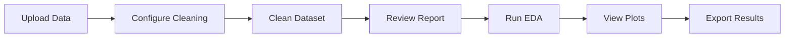

# Dashboard Pages Reference

Complete reference for all pages in the Mortality AMI Predictor Streamlit Dashboard.

## Overview

The dashboard contains **8 specialized pages** for the complete ML workflow. This guide provides detailed documentation for each page.

> 💡 **Tip**: For general dashboard information, see [Dashboard Overview](dashboard-overview.md)

## 🏥 Main Page (Dashboard.py)

### Purpose
Landing page that provides an overview and quick navigation to all features.

### Features
- **Welcome Section**: Introduction to the application
- **Feature Overview**: Summary of all available tools
- **Quick Links**: Direct access to each page
- **Getting Started**: Brief tutorial for new users
- **Documentation Links**: Access to full documentation

### Key Elements
```python
# Main sections displayed:
- Project logo and title
- Feature cards with icons
- Navigation sidebar
- Session state status
- Quick statistics
```

### When to Use
- First visit to understand capabilities
- Quick navigation hub
- Check current session status

---

## 🧹 Page 00: Data Cleaning and EDA

### Purpose
Complete data cleaning and exploratory data analysis workflow.

### Features

#### 1. Data Loading
- **File upload**: CSV or Excel files
- **Path loading**: Load from filesystem
- **Sample data**: Use built-in example dataset

#### 2. Data Cleaning

**Configuration Options**:
```python
# Missing Values
- Threshold: 0-100% (columns with more missing are dropped)
- Imputation: Simple, KNN, Iterative

# Outliers
- Detection: IQR, Z-score, Isolation Forest
- Action: Remove, Cap, Keep

# Encoding
- Strategy: OneHot, Label, Target, Ordinal

# Discretization
- Enabled: Yes/No
- Method: Quantile, Uniform, K-means
- Bins: 3-10
```

**Cleaning Report**:
- Rows before/after
- Columns removed
- Missing values imputed
- Outliers detected/handled
- Encoding summary

#### 3. Exploratory Data Analysis

**Univariate Analysis**:
- Continuous variables: Histograms, box plots, statistics
- Categorical variables: Bar charts, frequency tables

**Bivariate Analysis**:
- Continuous vs Target: Box plots by target, t-tests
- Categorical vs Target: Stacked bars, chi-square tests
- Correlation matrix: Heatmap with values

**Multivariate Analysis**:
- PCA visualization: 2D/3D scatter plots
- Feature interactions: Interaction heatmap
- Cluster analysis: K-means clustering

#### 4. Export Options
- **Cleaned dataset**: CSV download
- **EDA report**: PDF with all plots
- **Statistics**: JSON with summary stats
- **Plots**: Individual PNG downloads

### Workflow



### UI Components

**Sidebar**:
```
┌─────────────────────────┐
│ Cleaning Configuration  │
├─────────────────────────┤
│ ☐ Handle Missing (80%)  │
│ ☑ Detect Outliers (IQR) │
│ ☑ Encode Categoricals   │
│ ☐ Discretize Continuous │
├─────────────────────────┤
│ [Clean Dataset] Button  │
└─────────────────────────┘
```

**Main Area**:
```
┌─────────────────────────────────────┐
│ Dataset Preview                     │
│ ┌─────────┬──────┬──────┬─────┐   │
│ │ Feature │ Type │ Miss │ ... │   │
│ └─────────┴──────┴──────┴─────┘   │
├─────────────────────────────────────┤
│ Cleaning Results                    │
│ ✓ 5 columns removed (>80% missing) │
│ ✓ 1,234 missing values imputed     │
│ ✓ 45 outliers capped                │
├─────────────────────────────────────┤
│ EDA Visualizations                  │
│ [Tabs: Univariate | Bivariate | ...]│
└─────────────────────────────────────┘
```

---

## 📊 Page 01: Data Overview

### Purpose
Explore dataset characteristics with interactive visualizations.

### Features

#### 1. Dataset Summary
```
Total Samples: 10,000
Features: 45
Target: mortality_inhospital
Class Balance: 85.2% / 14.8%
Missing Values: 2.3%
```

#### 2. Variable Statistics

**Continuous Variables**:
| Variable | Mean | Std | Min | Max | Missing |
|----------|------|-----|-----|-----|---------|
| age | 65.2 | 12.4 | 18 | 95 | 0.0% |
| hr | 82.5 | 18.3 | 45 | 180 | 1.2% |

**Categorical Variables**:
| Variable | Unique | Most Common | Frequency | Missing |
|----------|--------|-------------|-----------|---------|
| sex | 2 | Male | 6,245 (62%) | 0.0% |
| killip | 4 | Class I | 7,832 (78%) | 0.5% |

#### 3. Interactive Visualizations

**Distribution Plots**:
- Select variable from dropdown
- Histogram with KDE overlay
- Box plot with outliers
- Grouped by target

**Correlation Matrix**:
- Interactive heatmap
- Filter by correlation threshold
- Click to see scatter plot

**Missing Value Analysis**:
- Bar chart of missing percentages
- Missing value patterns
- Heatmap of missingness

---

## 🤖 Page 02: Model Training

### Purpose
Train and optimize machine learning models.

### Features

#### 1. Model Selection

**Available Models**:
- **Logistic Regression**: Fast baseline
- **Random Forest**: Robust ensemble
- **XGBoost**: High performance
- **Neural Network**: Deep learning
- **Custom Models**: User-defined models

#### 2. Hyperparameter Tuning

**Random Forest**:
```python
n_estimators = st.slider("Trees", 10, 500, 100)
max_depth = st.slider("Max Depth", 3, 30, 10)
min_samples_split = st.slider("Min Split", 2, 20, 5)
```

#### 3. Cross-Validation

```python
cv_folds = st.slider("CV Folds", 3, 10, 5)
cv_metrics = ["roc_auc", "accuracy", "f1"]
```

---

## 🔮 Page 03: Predictions

### Purpose
Make predictions on new patients using trained models.

### Features

#### 1. Single Patient Prediction
- Input form with all features
- Real-time risk calculation
- Visual risk indicator
- Feature contributions

#### 2. Batch Predictions
- CSV upload
- Batch processing
- Results download
- Risk stratification

---

## 📈 Page 04: Model Evaluation

### Purpose
Comprehensive model performance evaluation.

### Features

#### 1. Performance Metrics
- AUC-ROC
- Accuracy
- Sensitivity/Specificity
- PPV/NPV
- F1 Score

#### 2. Visualizations
- ROC Curve
- Precision-Recall Curve
- Calibration Plot
- Confusion Matrix
- Decision Curve Analysis

---

## 🔍 Page 05: Explainability

### Purpose
Understand and interpret model predictions.

### Features

#### 1. Global Explanations
- SHAP summary plot
- Feature importance ranking
- Interaction effects

#### 2. Local Explanations
- Individual patient SHAP values
- Waterfall plot
- Force plot
- Feature contributions

---

## 📋 Page 06: Clinical Scores

### Purpose
Calculate traditional clinical risk scores.

### Features

#### 1. GRACE Score
- Input form
- Risk calculation
- Interpretation

#### 2. TIMI Score
- Risk factors checklist
- Score calculation
- Risk stratification

#### 3. Comparison
- ML vs Clinical Scores
- Calibration comparison
- Decision support

---

## 🔧 Page 07: Custom Models

### Purpose
Create and integrate custom models.

### Features

#### 1. Model Upload
- Python file upload
- Code validation
- sklearn compatibility check

#### 2. Model Testing
- Fit/predict tests
- Compatibility checks
- Performance evaluation

#### 3. Model Registration
- Add to registry
- Integration with training page
- Save for future use

---

## Session State Reference

Key session state variables:

```python
# Data
st.session_state.raw_data
st.session_state.cleaned_data
st.session_state.X_train
st.session_state.X_test
st.session_state.y_train
st.session_state.y_test

# Models
st.session_state.model
st.session_state.model_type
st.session_state.model_params

# Results
st.session_state.predictions
st.session_state.shap_values
st.session_state.metrics
```

## See Also

- [Dashboard Overview](dashboard-overview.md)
- [API Reference](../api/)
- [User Guide](../user-guide/)
