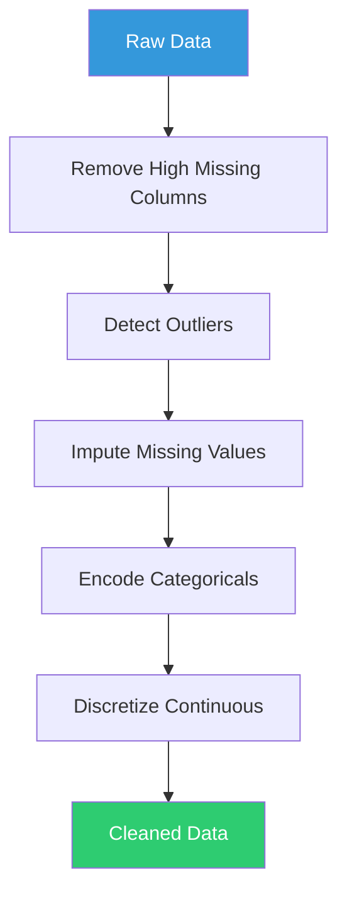

# Data Cleaning Guide

Learn how to clean and preprocess your AMI patient data for machine learning.

## Overview

Data cleaning is a critical first step in any ML pipeline. The Mortality AMI Predictor provides automated tools to handle common data quality issues in medical datasets.

## Quick Start

### Using the Dashboard

1. Navigate to **🧹 Data Cleaning and EDA** page
2. Upload your CSV dataset
3. Click **"Clean Dataset"**
4. Review the cleaning report
5. Download the cleaned data

### Using Python API

```python
from src.cleaning.cleaner import DataCleaner
import pandas as pd

# Load raw data
df = pd.read_csv("raw_patient_data.csv")

# Initialize cleaner
cleaner = DataCleaner(
    target_column="mortality_inhospital",
    metadata_path="variable_metadata.json"
)

# Clean data
cleaned_df = cleaner.clean(df)

# Save
cleaned_df.to_csv("processed/cleaned_datasets/cleaned_data.csv", index=False)
```

## Cleaning Pipeline

The data cleaning process follows these steps:



## 1. Handling Missing Values

### Strategies

**Simple Imputation**:
```python
from src.cleaning.imputation import SimpleImputationStrategy

# Median for numeric
imputer = SimpleImputationStrategy(strategy="median")
df_imputed = imputer.fit_transform(df)

# Mode for categorical
imputer = SimpleImputationStrategy(strategy="most_frequent")
```

**KNN Imputation**:
```python
from src.cleaning.imputation import KNNImputationStrategy

# Use 5 nearest neighbors
imputer = KNNImputationStrategy(n_neighbors=5)
df_imputed = imputer.fit_transform(df)
```

**MICE (Multivariate) Imputation**:
```python
from src.cleaning.imputation import IterativeImputationStrategy

# Iterative imputation
imputer = IterativeImputationStrategy(max_iter=10)
df_imputed = imputer.fit_transform(df)
```

### Best Practices

!!! tip "Choose Based on Missingness Pattern"
    - **MCAR** (Missing Completely at Random): Simple imputation
    - **MAR** (Missing at Random): KNN or MICE
    - **MNAR** (Missing Not at Random): Consider domain knowledge

## 2. Outlier Detection

### Methods

**IQR Method** (Recommended for medical data):
```python
from src.cleaning.outliers import OutlierDetector

detector = OutlierDetector(method="iqr")
outlier_mask = detector.detect(df, columns=["age", "heart_rate", "bp"])

# Remove outliers
df_clean = df[~outlier_mask]

# Or cap them
df_capped = detector.cap_outliers(df, columns=["age", "heart_rate"])
```

**Z-Score Method**:
```python
detector = OutlierDetector(method="zscore", threshold=3)
outliers = detector.detect(df)
```

**Isolation Forest**:
```python
detector = OutlierDetector(method="isolation_forest", contamination=0.05)
outliers = detector.detect(df)
```

!!! warning "Don't Blindly Remove Medical Outliers"
    Extreme values in medical data may be clinically meaningful. Always review outliers before removal.

## 3. Categorical Encoding

### One-Hot Encoding

For nominal variables with few categories:

```python
from src.cleaning.encoding import OneHotEncodingStrategy

encoder = OneHotEncodingStrategy()
df_encoded = encoder.encode(df, columns=["sex", "admission_type"])
```

### Label Encoding

For ordinal variables:

```python
from src.cleaning.encoding import LabelEncodingStrategy

encoder = LabelEncodingStrategy()
df_encoded = encoder.encode(df, columns=["killip_class"])
```

### Target Encoding

For high-cardinality variables:

```python
from src.cleaning.encoding import TargetEncodingStrategy

encoder = TargetEncodingStrategy(target_column="mortality_inhospital")
df_encoded = encoder.encode(df, columns=["diagnosis_code", "hospital_id"])
```

## 4. Feature Discretization

Convert continuous variables to categorical bins:

```python
from src.cleaning.discretization import Discretizer

discretizer = Discretizer(n_bins=5, strategy="quantile")
df_binned = discretizer.discretize(df, columns=["age", "bp_systolic"])
```

## Variable Metadata

Define variable types for consistent cleaning:

```json
{
  "age": {
    "type": "continuous",
    "unit": "years",
    "range": [0, 120]
  },
  "sex": {
    "type": "categorical",
    "categories": ["M", "F"]
  },
  "bp_systolic": {
    "type": "continuous",
    "unit": "mmHg",
    "range": [60, 250]
  },
  "killip_class": {
    "type": "ordinal",
    "categories": [1, 2, 3, 4]
  },
  "mortality_inhospital": {
    "type": "binary",
    "target": true
  }
}
```

## Complete Example

```python
from src.cleaning.cleaner import DataCleaner
from src.data_load.loaders import load_dataset

# Load raw data
df = load_dataset("../DATA/recuima-020425.csv")

# Configure cleaner
cleaner = DataCleaner(
    target_column="mortality_inhospital",
    metadata_path="variable_metadata.json",
    missing_threshold=0.3,        # Drop columns with >30% missing
    outlier_method="iqr",          # IQR for outliers
    encoding_strategy="target",    # Target encoding
    imputation_strategy="knn",     # KNN imputation
    discretize_continuous=False    # Keep continuous
)

# Clean
cleaned_df = cleaner.clean(df)

# Get report
report = cleaner.get_report()
print(f"Rows: {report['rows_before']} → {report['rows_after']}")
print(f"Cols: {report['cols_before']} → {report['cols_after']}")
print(f"Missing imputed: {report['missing_imputed']}")
print(f"Outliers: {report['outliers_detected']}")

# Save
cleaner.save_cleaned_data(
    cleaned_df,
    "processed/cleaned_datasets/cleaned_data.csv"
)
```

## Validation

Always validate cleaned data:

```python
# Check for remaining issues
print("Missing values:", cleaned_df.isnull().sum().sum())
print("Duplicates:", cleaned_df.duplicated().sum())
print("Data types:\n", cleaned_df.dtypes)

# Verify ranges
print("\nAge range:", cleaned_df['age'].min(), "-", cleaned_df['age'].max())
print("BP range:", cleaned_df['bp_systolic'].min(), "-", cleaned_df['bp_systolic'].max())

# Check target balance
print("\nTarget distribution:\n", cleaned_df['mortality_inhospital'].value_counts())
```

## See Also

- [API: DataCleaner](../api/cleaning/cleaner.md)
- [API: Imputation](../api/cleaning/imputation.md)
- [API: Encoding](../api/cleaning/encoding.md)
- [API: Outliers](../api/cleaning/outliers.md)
- [EDA Guide](eda.md)
